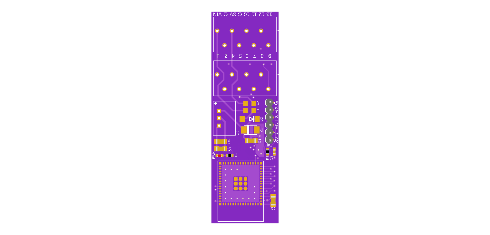
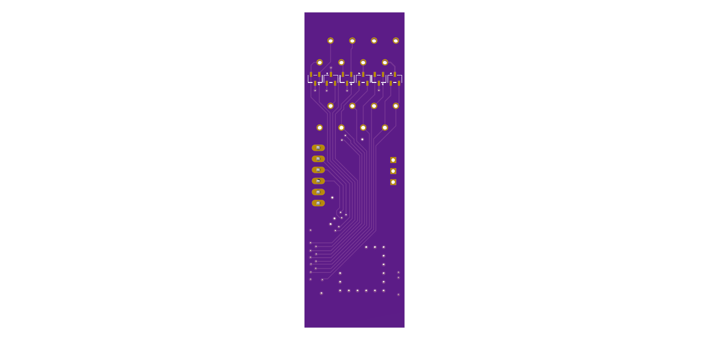

# ESP32S3_DIN_Module  
*DIN rail mountable module for ESP32-S3 with PTSA terminal blocks and compact layout*

A compact and robust adapter board designed for mounting the **ESP32-S3** module on a standard 35 mm DIN rail.  
It features spring-loaded terminal blocks for easy wiring and a clean layout for fast integration and prototyping.

---

## 🔧 Description

This module allows convenient installation of the ESP32-S3 on a DIN rail using reliable components and a service-friendly design.  
It includes push-in spring terminal blocks (Phoenix PTSA 0.5) for tool-less wiring and organized signal access.

### Key Features

- ✅ **DIN Rail Mounting** – Designed for standard 35 mm DIN rails using ITALTRONIC holders.  
- ✅ **Phoenix PTSA 0.5 Terminal Blocks** – Spring-loaded terminals for quick and secure wiring of I/O, power, and UART signals.  
- ✅ **Compact Layout** – Space-efficient PCB for neat and modular installations.  
- ✅ **ESP32-S3 Compatibility** – Supports full functionality of the ESP32-S3, including Wi-Fi and Bluetooth LE.  
- ✅ **Clear Pin Access** – Well-labeled terminal layout for easy debugging and expansion.

---

## 🛠️ PCB Manufacturing

All design files, including schematics, Gerber files, and BOM, are located in the `Electronic Design` directory.  
PCBs can be ordered from JLCPCB or any PCB manufacturer of your choice.

It is recommended to source components from trusted distributors such as Mouser, Farnell, Digi-Key, or TME.  
Schematic symbols and footprints were taken from Mouser part pages or official libraries.

---

## 🧾 Bill of Materials

The complete BOM is included in the `Electronic Design` directory.

### DIN Rail Mount Clips

- ITALTRONIC 2× [07.6010000](https://www.italtronic.com/en/products/din-rail-supports/07-6010000)  
- ITALTRONIC 1× [07.6000000](https://www.italtronic.com/en/products/din-rail-supports/07-6000000)

---

## 🖼️ Images

Front and rear views of the module:

  

---

## 🤝 Contributions

Contributions, issues, and suggestions are welcome!  
If you find bugs or want to suggest improvements, feel free to open an issue or submit a pull request.

---

## 📜 License

This project is licensed under the MIT License. See the [LICENSE](./LICENSE) file for details.
